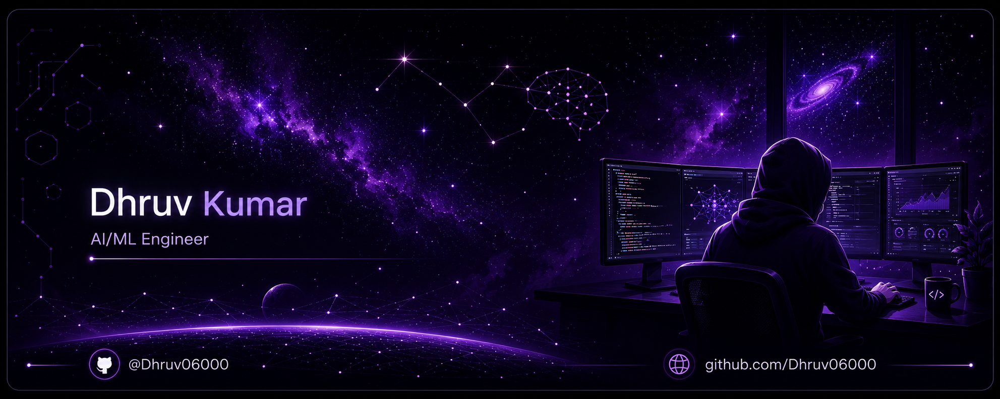

  

 
<h1 align="center">Hey there, I'm Dhruv 👋</h1>

  

Building intelligent AI applications using <b>Python</b>, <b>LLMs</b>, <b>RAG</b>, and modern backend technologies. 
Passionate about solving real-world problems through Artificial Intelligence and continuous learning.

  
  
  

<!-- ========================= About Me ========================= -->

<h2 align="center">👨‍💻 About Me</h2>

<table align="center">
<tr>
<td width="65%" valign="top">

- 🤖 Building **LLM-powered AI applications** with LangChain & Groq APIs.
- 🧠 Exploring **Generative AI, RAG Systems & NLP**.
- 🐍 Strong interest in **Python Backend Development**.
- 🔍 Learning **FastAPI, Docker, Vector Databases & Deployment**.
- 📚 Passionate about solving real-world problems using AI.
- 🌱 Currently improving my knowledge of **System Design & AI Engineering**.
- 🎯 Goal: Become an **AI/ML & Generative AI Engineer**.

✨ I believe in **Learn • Build • Share • Repeat**

</td>

<td width="35%" align="center">

</td>
</tr>
</table>

 
<!-- ========================= Tech Stack ========================= -->

<h2 align="center">
  
</h2>

 

<h3 align="center">💻 Languages & Backend</h3>

 

<h3 align="center">🛠️ Development Tools</h3>

 

<h3 align="center">🤖 AI / Machine Learning</h3>

 
<!-- ========================= GitHub Analytics ========================= -->

<h2 align="center">📊 GitHub Analytics</h2>

  

  

<!-- ========================= Contribution Snake ========================= -->

<h2 align="center">🐍 Contribution Graph</h2>

  <picture>
    <source
      media="(prefers-color-scheme: dark)"
      srcset="https://raw.githubusercontent.com/Dhruv06000/Dhruv06000/output/github-contribution-grid-snake-dark.svg" />
    <source
      media="(prefers-color-scheme: light)"
      srcset="https://raw.githubusercontent.com/Dhruv06000/Dhruv06000/output/github-contribution-grid-snake.svg" />
    
  </picture>

 
<!-- ========================= Connect With Me ========================= -->

<!-- ========================= Connect With Me ========================= -->

<h2 align="center">🚀 Let's Build Something Amazing Together</h2>

Whether it's AI, Machine Learning, Python, or Open Source—I'm always excited to collaborate, learn, and create impactful technology.

  
  
  

 
<!-- ========================= Footer ========================= -->

 

Designed & Built with 💜 by <b>Dhruv Kumar</b> 
Inspired by <a href="https://github.com/Houria-hs">Houria</a>'s GitHub profile design. 
Always Learning • Always Building • Always Improving 🚀

